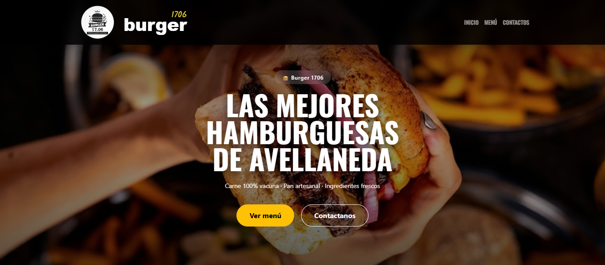
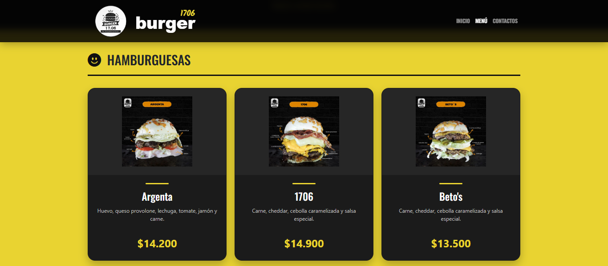
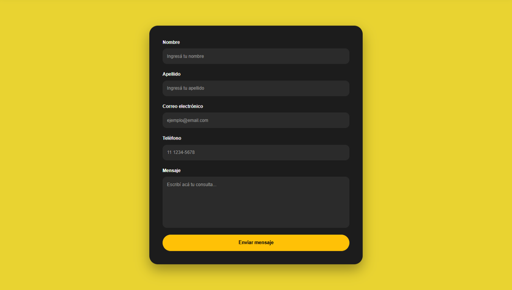

# 🍔 Burger 1706

Sitio web desarrollado para una hamburguesería ficticia, con un diseño moderno y una navegación intuitiva. El proyecto permite a los usuarios conocer el negocio, explorar el menú organizado por categorías y comunicarse mediante los canales de contacto o un formulario para consultas y reclamos.

---

## 📷 Vista previa



---

## ✨ Características

- 🏠 Página principal con presentación del negocio.
- 🍔 Productos destacados.
- 🖼️ Galería de imágenes.
- 📍 Información de las sucursales.
- 📋 Menú organizado por categorías.
- 📞 Acceso a los canales de contacto.
- 📝 Formulario para consultas y reclamos.
- 📱 Diseño adaptable para computadoras, tablets y celulares.

---

## 🛠 Tecnologías utilizadas

- HTML5
- CSS3
- Bootstrap 5
- Bootstrap Icons
- Font Awesome

---

## 📂 Estructura del proyecto

```
Burger1706/
│
├── Formulario_contacto/
├── Productos/
├── img/
├── js/
├── index.html
├── style.css
└── README.md
```

---

## 📸 Capturas

### Página principal


### Menú



### Formulario de contacto



---

## 🚀 Cómo ejecutar el proyecto

1. Clonar el repositorio.

```
git clone https://github.com/IHaruI/Hamburgueseria.git
```

2. Abrir la carpeta del proyecto.

3. Ejecutar `index.html` en cualquier navegador moderno.

---

## 🎯 Objetivo

Este proyecto fue desarrollado con fines de práctica para reforzar conocimientos en desarrollo web, aplicando buenas prácticas de estructura HTML, estilos con CSS, diseño responsive mediante Bootstrap y organización de archivos.

---

## 👤 Autor

**Patricio Galimany**

GitHub:
https://github.com/IHaruI
